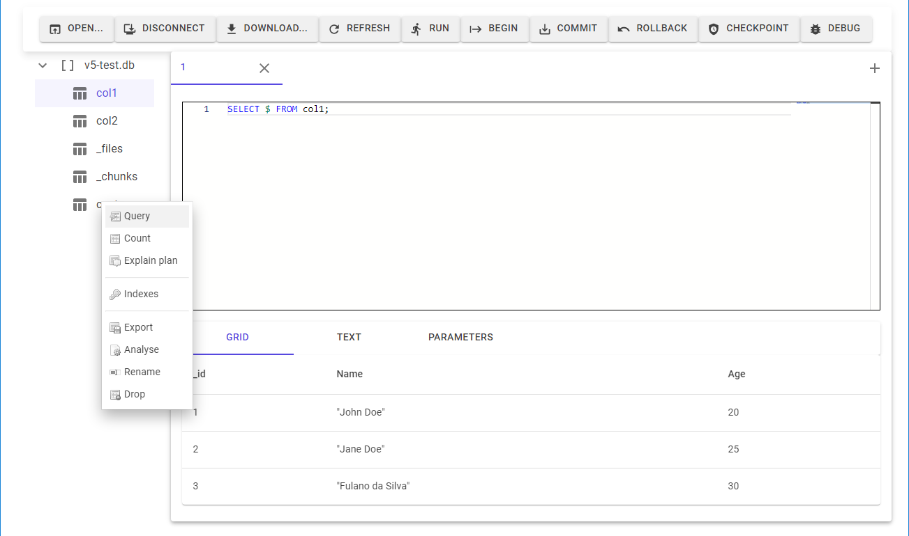

# LiteDB.Studio.WebAssembly
bringing the goodness of [LiteDB.Studio](https://github.com/mbdavid/LiteDB.Studio) to the web



## Prerequisites
* .NET Core 6

## Getting started
```bash
git clone https://github.com/TrevorDArcyEvans/LiteDB.Studio.WebAssembly.git
cd LiteDB.Studio.WebAssembly
dotnet restore
dotnet build
dotnet run
```
open [LiteDB.Studio.WebAssembly](https://localhost:7050/)

## LiteDB bugs
~~It seems that [_LiteDB_](https://github.com/mbdavid/LiteDB) was never really intended to operate on a stream:~~
* ~~[Exception thrown dropping collection when database loaded from memory stream](https://github.com/mbdavid/LiteDB/issues/2247)~~
* ~~[Collection returns incorrect count when database loaded from memory stream](https://github.com/mbdavid/LiteDB/issues/2248)~~

All streams are not the same and we must use `File.ArrayBufferAsync()` to create a compatible stream.

## Limitations
Encryption (System.Security.Cryptography.Algorithms) is not support on WebAssembly, so it is not possible
to open an database with a password.

## Further work
* support options when opening:
  * ~~password~~
  * collation
  * upgrade from v4
* ~~support disconnect~~
* ~~download updated database~~
